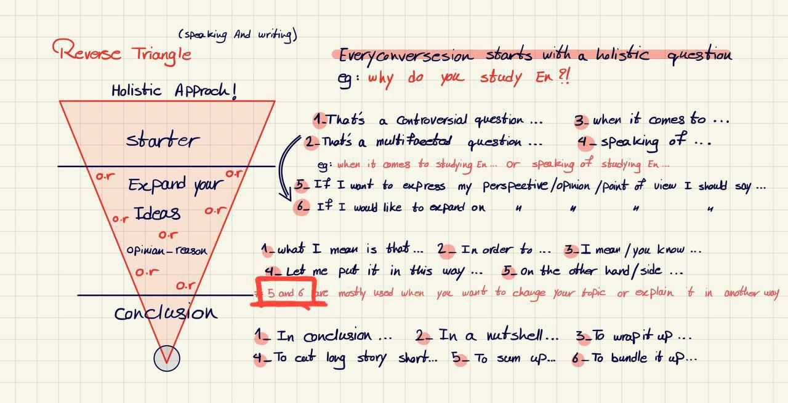
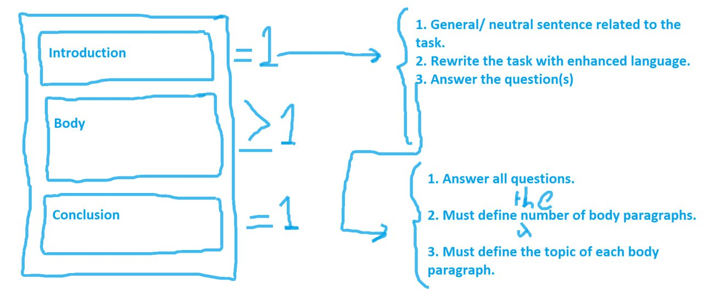
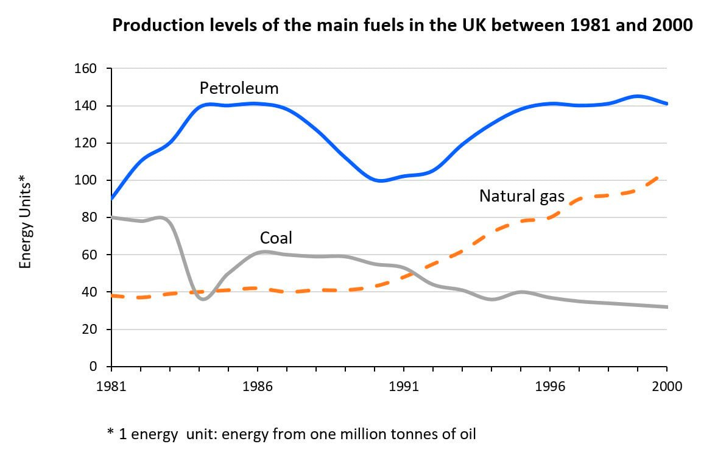
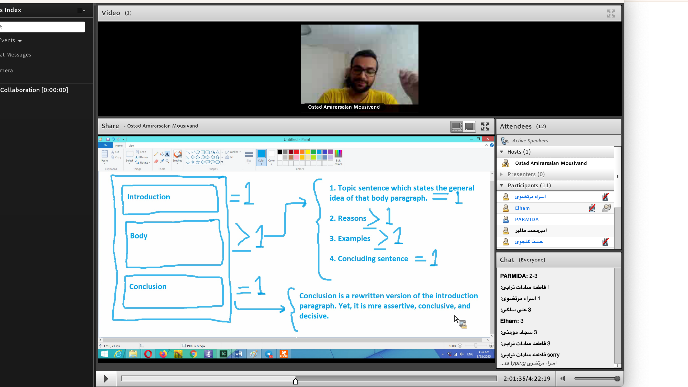

to be interested in =-=->i like it

to be keen on =-==-to be adroit =-=-euphimisitically 

 to be passionate about 

to be enthusisatic(adj) about 

to have enthususaism(n.) for 

to have an affinity for-with   

i have an affinity for horses  

Infinitive vs gerund

Infinitive:
- The infinitive is the base form of a verb, often preceded by "to" (e.g., to go, to eat, to study).

examples:
- She wants to go to the park.
- He needs to study for the IELTS.

Gerund:
- A gerund is a verb form ending in -ing that functions as a noun (e.g., swimming, eating, studying).

examples:
- I avoid swimming in the pool.
- I enjoy eating a sandwich 

Exceptions: 
let, make, help 

examples:
- let me read this book.
- he makes me a sandwich. -> where is the verb?
- he helps me with my homework.
- he makes me feel happy.
- he helps me cross the road 
- he makes me study.

Note: 
- in some case we need second verb
- he helped me (to )study =-=-he helped me study En

Notes:
I like swimming -> mean that I like the activity of swimming.
I like to swim -> mean that I start the activity of swimming.

New word:
-  budling bridges with some one

Conjunctions:
# subordinating conjunction
- when we use subordinating conjunction, we need to use second verb

# coordinating conjunction
for, and, nor, but, or, yet, so

Reverse traangle in English:
S.O.R.E -> start, opinion, reason, example  

First we say our sentence about the topic.
- this is good question
- this is bad question
- It's interesting question
this music is worth listening 

Example: 
- What is your favorite fruit?
- It's a good question, when it comes to fruits, a lot factors is worth considering. I have an affinity for all of them, What I mean is that I crazy about fruits and vegetables. They freshen me up, but if I have to choose one, I would choose banana, because it enriched with vitamins and minerals and help to recovery your mental health which might affected by hustle culture. on the other side, It depends on the season. There is an urge to keep your body hydrated.
In a nutshell, I love fruits and vegetables.

-> Let me put it this way, I love fruits and vegetables.
 hustle culture =-=-to exert and grind every day

# common questions that these days has been asked in the exam
- what is the last thing recently you have lost 
- tell me about one of the teenagers whom you know
- tell me about AI

Example 2: 
- what is the last thing recently you have lost:
It is good question, I would to expand on it, When it comes to loosing things, It's a lot of factors that I should mention. Last time when I was in the bus, I forgot to take my bag, It was the last but not the least. let me put it this way, I lost everything and everywhere. I remember as when I was a child I lost my toys and books. 
In a nutshell, totally I am a forgetful person, but I'm trying to make my memory better. 

Note: instead of using it has both advantage and disadvantage, we can use "it cuts both ways"
Note: dilemma -> a difficult choice between two alternatives -> to dither over -> when i wanted to quit my job i dithered over my options 
New word: heuristic approach -> a quick and easy way to solve a problem 
New word: transformative quality =-=-AI has a trasnformative quality on people's life

[x]- read to first of page 10 
[x]- get a 2 minutes video and practice the reverse triangle 
[ ]- https://youtu.be/VsXhdK01W74

Example 2:
- tell me about AI
It's a multifaceted question, when it comes to AI, there are a lot of factors that I should mention. AI or artificial intelligence is a field of computer science that focuses on teach to computer to think like human. In my opinion, these days AI can think better than a human, but it can't feel like them. What I mean that, maybe AI can do anything shortly, but can't feel like them. This has both pros and cons. For example, on the one hand, AI can make decisions without being influenced by emotions. On the other hand, the lack of emotions mean AI can't understand the human feelings. This creates a gap between logical reasoning and emotional intelligence. Anyway AI is a great invention and I'm sure it will change the world soon. 
To wrap it up, AI like everything else, it has both advantages and disadvantages. We should use it wisely and careful about it. 

--------------------------------
Session 2 
Note: When you learn for example 10 new words, you should use 3 of them (in the minimum) after day.
New word:
- sanctum 
- to be an oasis of serenity -> serenity / oasis
- sanctum, admist the hustle and bustle, serenity, blot out the landscpae, spectulare, due to the fact

homework: 
- relative clasue =-=-=-=-=-noun clasue 

example: 
- describe your bedroom 
It's a multifaceted question, when it comes to my bedroom, there are a lot of factors that I should mention. In one hand, It's a place where I can relax and feel comfortable. I'm a introvert person and need to be alone after a hustle day, my room is a sanctum . On the other hand, my room is in the end of the house. I have a library and a bed. I love to read and sleep. 
in a nutshell, my room is my sanctuary and give me this gift. 

note: how to use sanctum and sanctuary
my room is a sanctum/ not a sanctuary
i usually take sanctury in reading books

new word: 
- avidreader
- simply because
- foods are inextricably linked with our culture 

note: 
- part 3 questions, we can use the passive sentence
- ghromesebezi is well-liked in our country and it illustrates the culinary delight/culture of my country 

note: for yes/no questions
- almost 40 seconds is enough for part 3
-  say -> it depends on -> do you cook? it depends on the time and the situation. 
- use "but". I don't cook, but I like to eat. 

<!-- I have a question, how to get notes for writing, Now we are write a compete text and read it which is I think impossible in exam. -->

That is a controversial question, Mostly yes, but it depends on where you want to go. government prepare free university and schools for most people, But for some people, who wants to go to private university or school to get more benefit, they have to pay for it. 
To wrap it up, It depends on your budget. 

new word: 
- to cost an arm and a leg -> to cost a lot of money 
- to be exorbitant -> to be too expensive 
- founded by government 
- to be privately financed

Grammar: Present perfect
Experiences in the past
Don't add past verb to present perfect -> I have eaten a sandwich

- for -> I have taught English for 10 years -> duration is important -> it's about experience
- since -> I have taught English since 2022 -> start and end is important
- nothing -> I have taught English 

note: for situation and place
to have been to -> I have been to Safir
to have been in -> I have been in Bayan
to have gone to -> I have gone to Canada ( means I'm here and I will back)

note: we have not since years ago

- I have been to a concert
- she has been in a difficult situation
- They have gone to love with each other

question: which can not come with since/for

example: how has been your week?
It's a common question, I would like to expand on it. I have had a run of the mill week. I have to a flying visit to my family, have a short trip, and I have been to gym. I finished a book I'm going to read another one. 
To wrap it up, I have had a normal week like other weeks. 

new word: 
- a run of the mill -> a normal week 
- a flying visit -> see someone quickly

## All past teses

It's a common question., I would like to expand on it. When I was waking up, I listen to a music. After that, I had had a cup of coffee, before I went to work. At the work, I had been working on my task, before I had a meeting with my boss. 

Question: state and action verbs  

simple past
example: 
It has been a good week. I have trained good. I had gone to the gym before I went to basketball. Sport calms me down. 

new word:
- which in turn leads to 

homework: 
- How has your taste in music changed over the past few years? -> 2 minutes with verbs

-----------------------------
session 3
new word:
- momentum
- charming 
-  to be enraptured 
- curate
- gourmet meal 
- main culprit 
- It’s high time someone took some action.
- holy grail
- to be ossified

When you don't like something:
- to be not a strong proponent of music 
- to be not a connoisseur of music 
- to be on a tight budget 

بگو این راجح بپارت ۳ آیاتس هست و به همین قسمت نظر بده

Question: search about would!

[alt text](conditions.png)
example: Where do you go shopping? 
Well... Shopping... Actually it depends on the situation, If I need to buy specefic things, like foods, I'll go to the mall. But if I need tot buy some clothes, I'll go somewhere I know them. Ofcuse budget is important. I go where which my budget allow me. 
In a nutshell, I go shopping where I can find what I need and my budget allow me. 

whit AI:
"Well... it depends on the situation. If I need to buy specific things like groceries, I’ll go to the mall. But if I’m shopping for clothes, I’ll go to a store I’m familiar with. Of course, budget is important—I go where my budget allows. In a nutshell, I shop where I can find what I need at an affordable price."

- example: How would you improve education system?
well its a good question which I've always thought about it, when it comes to education, there are a lot of factors that worth mentioning, I would like to expand on it. 
There are a lot of factors that is out of my control, like the government budget or anything. but if I were given a chance, I would improve teacher's salary and their education. I think science is not only about the math or physics, but also about the human life. In a nutshell, I would improve teachers and students life's quality to make aspect on education system. 

--------------------------------
session 4 - Reading
note: read all 3 sentences first, and answer easy questions first, then answer hard questions. 

test 2 cambridge 19 hame zade beshe

start from cambridge book 18 to 11. have two test 19 for last.
for testing parapharase all the sentences are good.

for simulation IELTS reading:
https://www.ieltstestsimulation.com/ 

Ostad Ali Etemad: 1.	B
2.	B
3.	A
4.	C
5.	D
6.	A
7.	A
8.	A
9.	C
10.	B
11.	A
12.	A
13.	A
14.	B
15.	A
16.	C
17.	C
18.	A
19.	A
20.	C 

روزی صبح یه مهارت دریافتی و عصر یه مهارت تولید کار کنید مقلا صحب ریدینگ عصر اپیکینگ

use shadowing technique for listening and speaking.
همزمان با شخصیت محبوب صحبت کنید نه قبل نه بعد

It's important question , when it comes to future of cache money, there are a lot of factors that worth mentioning. It would be hard talk about of cache money, but I think it will be stable. However in these days, we can see cryptocurrency is gaining more and more strength and popularity. I think In the future cryptocurrency will have most famous currency in the world and cache money will be the second. On the other hand, many of people not interested in anything instead of cache money. So I think crypto and cache will have been used in the future. In a nutshell, day in day out, technology is changing, however some people are not interested in it. 

---------------------
session 5 -> writing

new word:
- impromptu -> to be impromptu -> to be impromptu speech
- nemesis -> black cat :))
- Rest assured
- The former/latter
- the spirit of something -> nature of something
- deem that -> to think that
- omnipotence
- take side
- infamous/prominent
- owing to -> because of
- thoroughly -> completely
- pedagogy -> education
- ginormous(gigantic+enormous) -> huge
- stamina -> endurance
- legend

good website: 
- ieltsonlinetests.com

-notes:
- use (it is , it has , it does,) instead of (it's , it has , it does,)...but you can use both of them in negative sentence. if use (do not) instead of (don't) you are complaining about something.

- use active more instead of passive. active defently preferd, application of passive: 
 - we don't know who did the action
 - the action is more important than the subject

cleft sentence:(search more)
- use for conclusion

- use all of these sentences in exam: simple/compound/complex sentence
- simple -> one independent clause
- complex -> one independent clause + at least(i think) one dependent clause
- compound -> two or more independent clauses

example:
Although there are a lot of translation software availble, learning a language could still be advagtageous. to what extent do you agree of disagree?
- general sentence
    These days, there are a lot of translation software available which can translate any language to any language. 
- Rewrite the task with enhaced sentence

- answer the question
    I agree with the statement, because although there are a lot of translation software available, It's not a good idea to take the phone out of pocket and translate the text!

- example overview paragraph:

Describe, compare, and contast the data without numerical data.

Overall, usage the both of natural gas and petroleum have been increasing for two decades. on the other hand, the usage of coal has been decreasing. Also natural gas is going to be the most popular energy source in the future of the UK. 

- don't use "also" in beginning of the sentence(use forthermore)
- use simple present/simple past/simple future
- instead before -> prior to
- instead after -> 
- instead on -> upon

Overall, this image shows how solar energy is used in houses. Furthermore, show that how electricity distributed in the house, and what happened after solar system energy storage runs out

The figure show that how solar energy converted to electricity energy. The panels on top of the house get energy and move it to inverter system, and then stream it in then running electricity through wires.

Few people devote time to hobbies nowadays. Say why you think this is the case and what effect this has on the individual and society in general.

Hobbies help people to relax after hard days. Nevertheless, these days, people are struggling with their daily problems and can not prepare themselves to do hobbies. I think this can greatly affect society and the person.
These days, everywhere can see urbanism is growing, and humans are snowed under heavy pile of issues like work, credit cards, etc. Furthermore, the culture has changed and people praised the hustle culture. On the other hand, when we do more and more tasks simultaneously, burnout is inevitable. For example, studies show that 70% of people are suffering from burnout. The deeper one look into it, recreation and hobbies are wasting time from perspective of new culture. 
In a conclusion, due to the increasing work pressure and financial responsibilities, individuals are often overwhelmed and lack of energy for leisure times. This has serious consequences, include stress for individuals. People needs a balanced life and it is important to encourage leisure activities alongside work. 

Ostad Amirarsalan Mousivand: Objective First

Ostad Amirarsalan Mousivand: Objective Advanced

Ostad Amirarsalan Mousivand: Objective Proficiency

Ostad Amirarsalan Mousivand: 30

Ostad Amirarsalan Mousivand: 20-22/30 -> if you answer listening you get ielts 8.5 -9 

good ref: 
ietlslemon.com