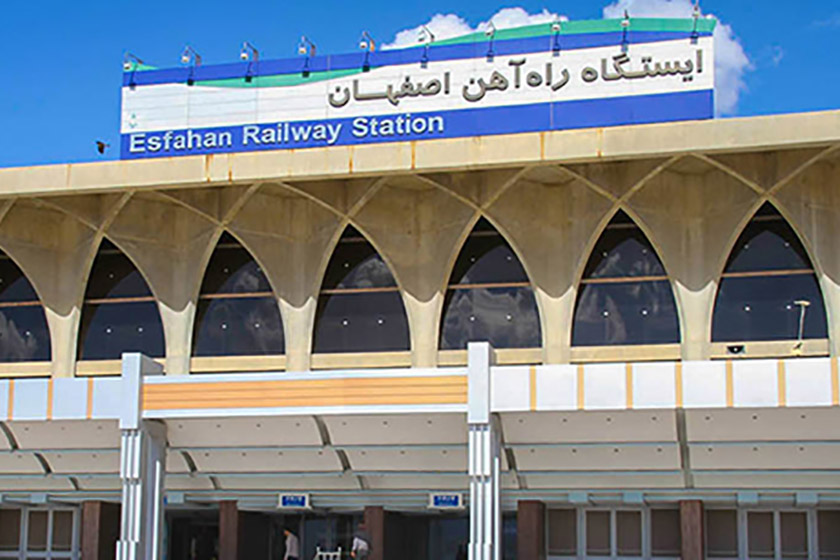
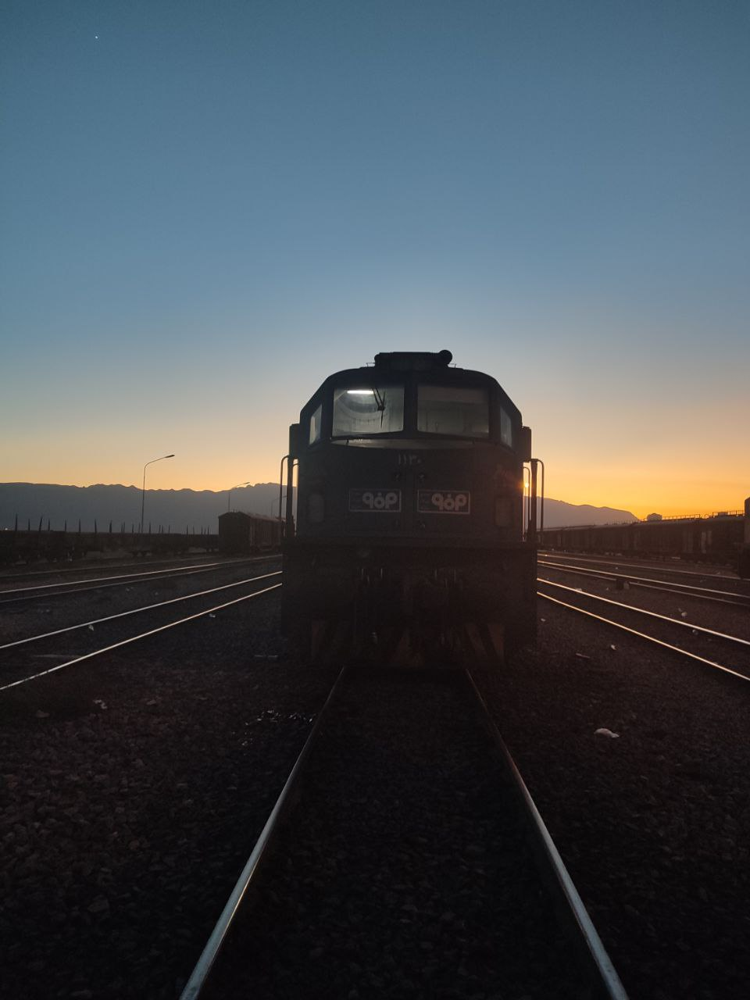
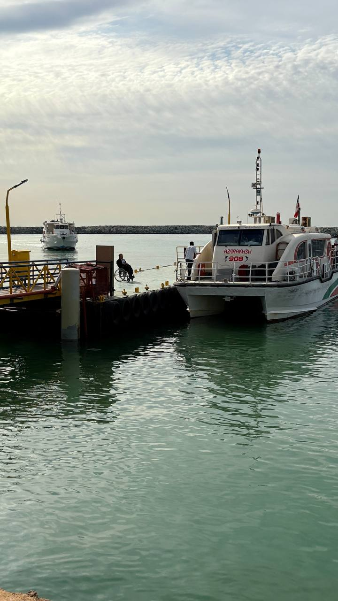
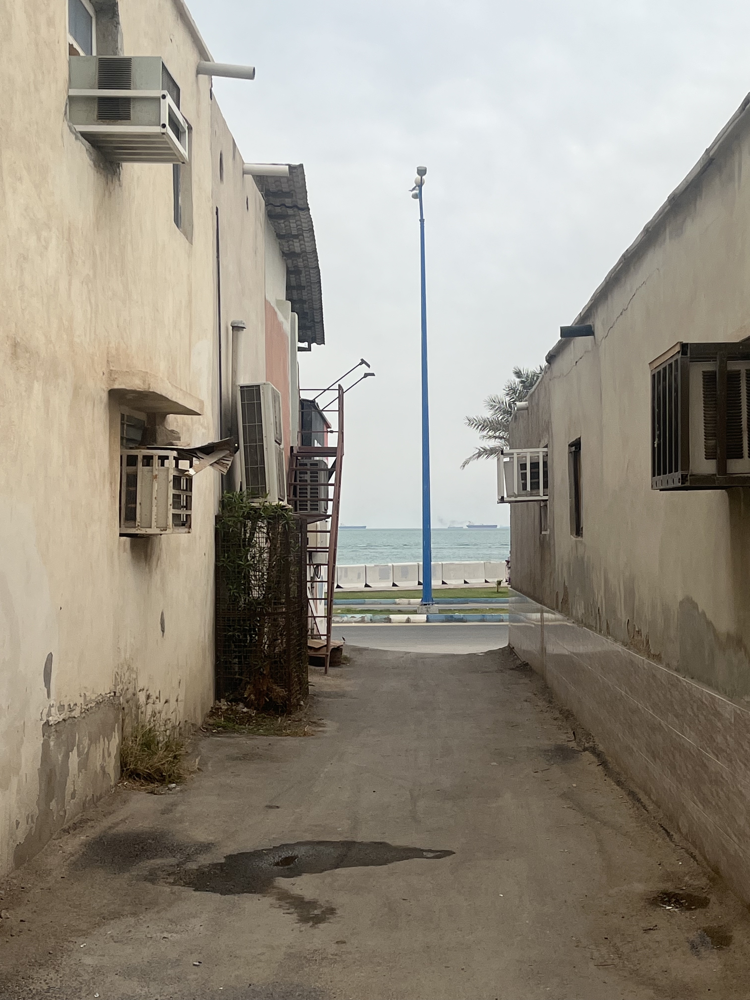
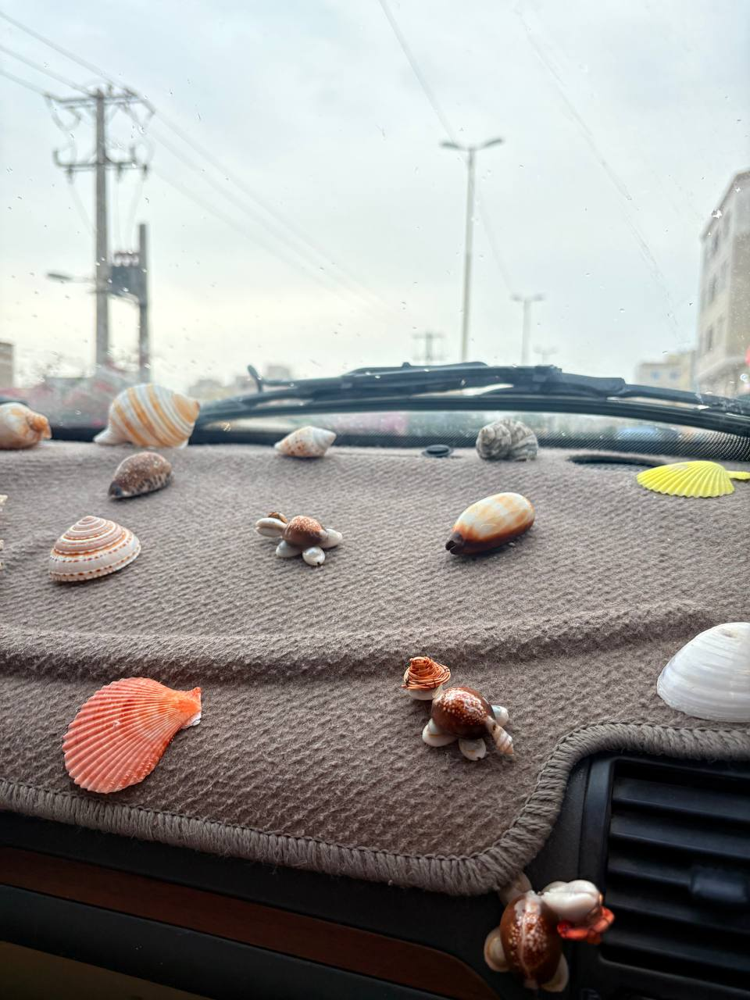

<!-- # روز اول سفر به قشم – ماجراهای قطار و اولین آشنایی‌ها -->

همه چیز از صبح روز اول شروع شد. مهدی و محمدرضا اومدن دنبالم و منم تند تند وسایلم رو جمع کردم. مامانم برامون یه کم بندری آماده کرده بود، داغ داغ برش داشتم و دویدم دم در. چمدون‌ها رو بار زدیم و راه افتادیم به سمت ایستگاه قطار اصفهان. بعد از گذاشتن وسایل توی دستگاه ایکس‌ری، رفتیم سمت قطار.

#### **ماجراهای کوپه‌نشینی!**
بلیطم برای یه کوپه جدا از دوستام بود. وقتی وارد کوپه شدم، یه خانواده نشسته بودن. مسئول قطار اومد و گفت:  
**«آقای مومنی، میشه لطفاً جاتون رو عوض کنید تا این خانواده راحت‌تر باشن؟»**  
گفتم: **«آره بابا، برای من که فرقی نداره، میرم کوپه بغلی.»**  
رفتم نشستم تو کوپه بغلی که بعد چند دقیقه دو تا دختر اومدن نشستن. دوباره مسئول قطار اومد و گفت:  
**«میشه بری کوپه بعدی؟»**  
گفتم: **«آقا جان مسخره‌مون کردی؟ خودم چند دقیقه دیگه میرم پیش دوستام، نیاز نیست هی منو بلند کنی!»** 😆  

اون دو دختره خیلی آدمای باحالی بودن، چند باری قشم رفته بودن. راستش تو ذهنم مرور می‌کردم که چه خوب میشه شمارشونو بگیرم، چون هم جاهای قشم رو بلد بودن، هم احتمالاً خوش می‌گذشت! ولی بعد گفتم **«ولش کن، زشته آخه!»** 😅

همون موقع دوستم اومد دنبالم و گفت: **«پاشو بریم تو کوپه خودمون.»** لحظه خداحافظی رسید، اما من که بیخیال نشدم! تو دلم گفتم **«فردا که رسیدیم بندرعباس، میرم پیداشون می‌کنم و شمارشونو می‌گیرم!»** 🤞

#### **رسیدن به بندرعباس – مأموریت غیرممکن!**
نزدیک بندر که شدیم، به مهدی گفتم: **«سریع وسایل رو جمع کنید، باید زود پیاده بشم اینا رو پیدا کنم.»**  
مهدی هم گفت: **«حله، خیالت راحت!»**  
اما محمدرضا یه کم خونسردتر بود و گفت: **«نه بابا، هنوز درهای قطار باز نشده، نگران نباش.»**  
۵ دقیقه بعد دیدم ای دل غافل! همه دارن از قطار پیاده می‌شن و ما هنوز اینجا نشسته‌ایم! 😱  
بدو بدو رفتم دم در، ولی هر چی گشتم، خبری از اون دخترا نبود. غم وجودمو گرفت. گفتم: **«بیخیال، حداقل بریم دستشویی!»** 🤦‍♂️  

ولی همونجا که برای من مثل اتاق فکره، یه جرقه تو ذهنم زد: **«اگه اینا از سالن انتظار هم بیرون رفته باشن، باید منتظر تاکسی‌ای چیزی باشن تا برن سوار لنج بشن.»** تندی شلوارمو کشیدم بالا و دویدم بیرون. به به! همشون وایساده بودن، تازه تعدادشون هم بیشتر شده بود.  
رفتم جلو و گفتم: **«یه شماره‌ای چیزی بدید که اگه سوالی داشتم در مورد قشم ازتون بپرسم...»**
اونا هم گفتن: **«اوکی، اینم شماره!»** و خداحافظی کردیم.

#### **ماجرای اقامت – چرا نمیرید یه جا دیگه؟!**
از قبل جایی رزرو نکرده بودیم، پس تصمیم گرفتیم همون هتل اونا رو امتحان کنیم. رسیدیم هتل و گفتیم:  
**«یه اتاق سه نفره می‌خوایم.»**  
مسئول هتل با یه لبخند خاص گفت: **«ساده‌ای؟ همشون پر شدن!»** 😑  

شروع کردیم تو سایت‌های اقامتی دنبال خونه گشتن. بالاخره یه جای مناسب پیدا کردیم و زنگ زدیم که بریم ببینیم. این وسط، اون دخترا هم استراحت کرده بودن و آماده بودن برای خرید. هر دو گروه همزمان تاکسی گرفتیم. تاکسی ما یه **ساینای سفید** بود، تاکسی اونا یه **تیبای سفید**. چند دقیقه بعد، یه **تویوتا هایلوکس** جلومون وایستاد و گفت: **«سوار شید.»**  
گفتم: **«نه آقا، ما ساینا گرفتیم.»**  
گفت: **«من همون تیبام، با یه ماشین دیگه اومدم.»**  
یه نگاه به جلو کردم و دیدم دخترها پریدن توی هایلوکس، خوشحال و خندان! و ما موندیم کنار خیابون با چمدونامون، منتظر یه ساینای سفید لعنتی! 😭  

راننده هایلوکس که اسمش ابراهیم بود، همونجا رفت. حالا نگه دار که ادامه داستان از اینجا جذاب‌تر میشه...! 😏