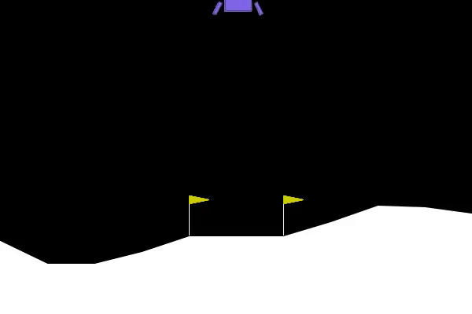

<!--  -->

Reinforcement Learning (RL) is a significant branch of machine learning where an agent interacts with an environment and improves its behavior based on the rewards it receives. In this article, we will explore the reinforcement learning process, answer some of your questions, and provide a complete example with Python code, including explanations of arrays, matrices, and the model training process.

---

## 1. Introduction to Reinforcement Learning

In reinforcement learning, an agent is placed in an environment and takes various actions to change its state. After each action, the agent receives a reward. The ultimate goal is to learn an optimal policy that selects actions in each state to maximize long-term rewards.

### Key Components of Reinforcement Learning:
- **Agent:** The entity that takes actions and learns.
- **Environment:** The world in which the agent operates.
- **State:** Represents the current situation of the environment.
- **Action:** The actions the agent can take.
- **Reward:** A signal indicating the agent's performance in the environment.
- **Policy:** A method for selecting actions in each state.

---
## 2. Q-Learning Algorithm
The core Q-update formula is as follows:

$$
Q(s, a) \leftarrow (1 - \alpha)Q(s, a) + \alpha\left(r + \gamma \max_{a'} Q(s', a')\right)
$$

Where:  
- $\alpha$: Learning rate  
- $\gamma$: Discount factor  
- $r$: Received reward  
- $s'$: Next state

---

## 3. Challenges of Continuous State Spaces and the Need for Discretization

In many real-world environments, state variables are continuous, such as speed, position, angle, etc., which can take any value within a specific range. For example, the speed of an object might be 10.0, 10.2, or 9.8 km/h. In such cases, creating a Q-table for every possible value (infinite states) is impossible.

### Why Use Discretization?
- **Covering Infinite States:**  
  If each state variable is continuous, the number of possible states becomes infinite. Discretization reduces the number of possible states by dividing continuous ranges into finite bins.
  
- **Easy Indexing:**  
  By converting continuous values into discrete indices, it becomes easier to access values in the Q-table.
  
- **Improved Learning:**  
  Even if there are minor differences (e.g., 10.0 vs. 10.2), the agent can use similar experiences within the same bin.

### Simple Example:
Suppose speed ranges from 0 to 10 km/h, and we divide this range into 10 bins:
- Bin 0: Speed 0 to 1
- Bin 1: Speed 1 to 2
- …  
- Bin 9: Speed 9 to 10

Thus, each continuous value is assigned to one of these 10 bins, and the bin is used as an index in the Q-table.

---

## 4. Practical Example: Training an Agent in the LunarLander Environment

In this section, we provide a complete example of creating and training a Q-Learning-based agent for the **LunarLander-v3** environment from the **Gymnasium** library. In this example, 8 state variables are divided into 10 bins, and a Q-table with dimensions  
\[(10, 10, 10, 10, 10, 10, 10, 10, 4)\]  
is created (8 dimensions for discrete states and 1 dimension for 4 possible actions).

### Sample Code

```python
import gymnasium as gym
import numpy as np

class QLearningAgent:
    def __init__(self, state_bins=10, learning_rate=0.1, gamma=0.99, epsilon=1.0):
        # Create LunarLander environment with graphical rendering
        self.env = gym.make("LunarLander-v3", render_mode="human")
        
        # Number of bins for each state variable
        self.state_bins = state_bins
        # Discrete state space: 8 variables, each divided into state_bins
        self.state_space = [state_bins] * 8  # Example: [10, 10, 10, 10, 10, 10, 10, 10]
        # Number of possible actions in the environment (4 actions)
        self.action_space = 4
        
        # Create Q-table as a zero array with dimensions (10,10,10,10,10,10,10,10,4)
        self.q_table = np.zeros(self.state_space + [self.action_space])
        print("Q-table dimensions:", self.q_table.shape)
        
        # Learning parameter settings
        self.lr = learning_rate    # Learning rate
        self.gamma = gamma         # Discount factor
        self.epsilon = epsilon     # Initial epsilon value for ε-greedy policy
        self.epsilon_decay = 0.995 # Epsilon decay over time
        self.epsilon_min = 0.01
        
        # Define ranges for state variables for discretization
        self.state_bounds = [
            (-1.5, 1.5),     # x position
            (-1.5, 1.5),     # y position
            (-5.0, 5.0),     # x velocity
            (-5.0, 5.0),     # y velocity
            (-3.14, 3.14),   # angle
            (-5.0, 5.0),     # angular velocity
            (0, 1),          # left leg contact
            (0, 1)           # right leg contact
        ]
    
    def discretize_state(self, state):
        """
        Convert continuous state to a tuple of discrete indices.
        For example, if state = [0.0, 0.5, ...], it will be converted to (5, 7, ...).
        """
        discrete_state = []
        for i, s in enumerate(state):
            low, high = self.state_bounds[i]
            # Scale the value to the range 0 to 1
            scaled = (s - low) / (high - low)
            # Convert the value to a bin index (from 0 to state_bins - 1)
            discrete = int(scaled * self.state_bins)
            # Ensure the index is within the valid range
            discrete = max(0, min(self.state_bins - 1, discrete))
            discrete_state.append(discrete)
        return tuple(discrete_state)
    
    def choose_action(self, state):
        """
        Choose an action using the ε-greedy policy:
        - With probability ε, a random action is chosen.
        - Otherwise, the action with the highest Q-value in that state is chosen.
        """
        if np.random.random() < self.epsilon:
            return np.random.randint(self.action_space)
        else:
            return np.argmax(self.q_table[state])
    
    def learn(self, state, action, reward, next_state):
        """
        Update the Q-value in the Q-table using the Q-Learning formula.
        """
        old_value = self.q_table[state + (action,)]
        next_max = np.max(self.q_table[next_state])
        new_value = (1 - self.lr) * old_value + self.lr * (reward + self.gamma * next_max)
        self.q_table[state + (action,)] = new_value
    
    def train(self, episodes=5):
        """
        Train the agent for a specified number of episodes.
        In each episode:
        - The environment is reset, and the initial state is obtained.
        - Steps are taken in the environment until the episode ends (either done or truncated).
        - At each step:
            - The continuous state is converted to a discrete state.
            - An action is chosen and executed.
            - The Q-table is updated.
        """
        scores = []
        for episode in range(episodes):
            state, _ = self.env.reset()
            total_reward = 0
            done = False
            truncated = False
            
            print(f"\n--- Starting Episode {episode+1} ---")
            while not (done or truncated):
                # Convert continuous state to discrete state, e.g., (5, 5, 3, 2, 7, 4, 0, 1)
                discrete_state = self.discretize_state(state)
                # Choose action using ε-greedy policy
                action = self.choose_action(discrete_state)
                # Execute action in the environment
                next_state, reward, done, truncated, _ = self.env.step(action)
                discrete_next_state = self.discretize_state(next_state)
                # Update Q-table
                self.learn(discrete_state, action, reward, discrete_next_state)
                state = next_state
                total_reward += reward
            
            # Decrease epsilon to reduce exploration after each episode
            self.epsilon = max(self.epsilon_min, self.epsilon * self.epsilon_decay)
            print(f"Episode {episode+1}/{episodes} completed. Score: {total_reward:.2f}, ε: {self.epsilon:.4f}")
            scores.append(total_reward)
        
        self.env.close()
        return scores

# Run the training example
agent = QLearningAgent()
scores = agent.train(episodes=5)
```

Code Explanation:
Creating the Q-table:
Using an array with dimensions [10, 10, 10, 10, 10, 10, 10, 10, 4], for each combination of 8 discrete variables (each with 10 possible values), 4 values for different actions are stored.

Discretization:
The discretize_state function converts continuous state values (e.g., speed, angle, etc.) into discrete indices for use in the Q-table.

Action Selection:
Using the ε-greedy policy, for each discrete state, an appropriate action is chosen and executed, leading to a reward and the observation of the next state.

Q-table Update:
The Q-value update formula is designed so that the agent uses past experiences to improve future performance.

Training Over Multiple Episodes:
The model is trained over several episodes, and after each episode, ε is reduced to gradually shift the agent from exploration to exploitation.

5. Conclusion
In this article, we explored the reinforcement learning process, particularly the Q-Learning algorithm. We highlighted important points such as the need for discretization of continuous state spaces and the use of Q-tables to store Q-values. We also provided a practical example, detailing the steps to create and train an agent.

We hope this article has clarified the main concepts of reinforcement learning and the challenges of working with continuous state spaces. In the future, you can deepen your understanding of reinforcement learning algorithms by studying and testing more examples.
